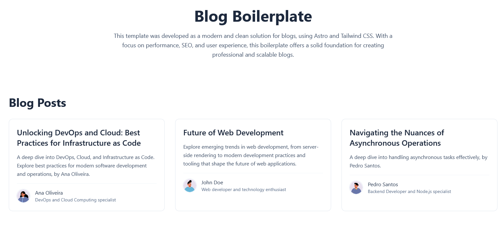

# Astro Blog Boilerplate

A very minimal blog boilerplate built with Astro, featuring content collections, author management, and flexible content modeling. While optimized for blogging, it's adaptable for docs, portfolios, or marketing sites.

## Screenshots

<div style="display: flex; justify-content: center; gap: 10px;">

</div>

For mobile view, see the screenshots for [posts](screenshots/posts-view-mobile.png) and [index](screenshots/post-view-mobile.png).

## Features

- **Modern Styling:**

  - Tailwind CSS for utility-first styling
  - Tailwind Typography (Necessary for Markdown formatting in Astro)
  - Responsive design out of the box

- **Pre-built Components:**
  - `BlogList.astro`: Ready-to-use component for displaying post listings
  - `Prose.astro`: Markdown formatter with consistent typography
  - `SocialIcons.astro`: A component to reference social icons quickly and easily
  - `A tag system`: A tag system is already implemented
- **Development Ready:**
  - Type-safe content handling
  - Hot module reloading
  - Optimized build process

## Content Configuration

The `content.config.ts` file defines three main collections:

### Blog Posts Collection

- Uses `glob` loader to process all Markdown files in `src/content/blog`
- **Required fields:**
  - `title` (string): The post's title
  - `date` (Date): Original creation date
  - `pubDate` (Date): Publication date (coerced from string)
  - `author` (reference): Links to an author in the `authors` collection
  - `category` (string): Post category (e.g., "Tech", "Life", "Code")
- **Optional fields:**
  - `description` (string): Short post summary
  - `updatedDate` (Date): Last modification date
  - `relatedPosts` (reference array): Links to other blog posts
  - `tags` (string[]): Array of related tags

### Authors Collection

- Loads data from `authors.json` file
- **Required fields:**
  - `name` (string): Author's full name
  - `email` (string): Valid email address
  - `avatar` (string): Path to author's image
- **Optional fields:**
  - `bio` (string): Author biography
  - `socialLinks` (object): May include:
    - `twitter` (string)
    - `github` (string)
    - `linkedin` (string)

### Categories Collection

- Defines available post categories
- **Required fields:**
  - `name` (string): Category name
  - `description` (string): Category description
  - `slug` (string): URL-friendly identifier

## Data Structure

### Authors Data (`authors.json`)

```json
{
  "john-doe": {
    "name": "John Doe",
    "email": "john.doe@example.com",
    "avatar": "/images/authors/john-doe.jpg",
    "bio": "A passionate writer and developer.",
    "socialLinks": {
      "twitter": "johndoe_twitter",
      "github": "johndoe_github",
      "linkedin": "johndoe_linkedin"
    }
  }
}
```

### Example Blog Post Frontmatter

```yaml
---
title: 'My First Post'
date: 2024-01-01
pubDate: 2024-01-01
author: 'john-doe'
category: 'Tech'
tags: ['astro', 'web-dev']
relatedPosts: ['second-post']
description: 'An optional description'
---
```

## Getting Started

### Change as you wish:

1. Authors in `authors.json`
2. Create blog posts in `src/content/blog`
3. Update site configuration in `astro.config.mjs`

## Contributing

Contributions are welcome! Feel free to fork the repository and submit pull requests with your improvements.

## RTFM

For detailed documentation, check the [Astro Docs](https://docs.astro.build/en/getting-started/).
