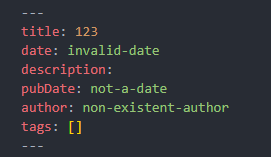
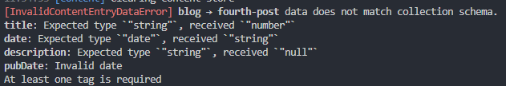

In this post, we will explain how the `content.config.ts` file works in our Astro Blog Boilerplate. The file is the central place where we define our content collections, their schemas, and the validation rules to ensure our Markdown posts and JSON files meet the desired standards.

## Overview

The `content.config.ts` file uses **Astro Content Collections** along with **Zod** for schema validation. Here’s what it does:

- **Collections**: Defines where and how to load content.

  - The `blog` collection uses a glob loader to recursively load all Markdown files from `src/content/blog`.
  - The `authors` collection loads a JSON file from `src/content/authors/authors.json`.

- **Schema Validation**: By using Zod, we validate that every content entry (e.g., blog posts) has all required fields with the correct type.
  - For example, the `blogSchema` ensures the post has a valid `title`, `date`, `pubDate`, an `author` reference, and at least one tag.
  - If the Markdown frontmatter has an error (e.g., an incorrect date or missing field), Astro will throw a validation error.

## Detailed Look at the Schema

Take a look at a portion of the `blogSchema` in our `content.config.ts` file:

```typescript
const blogSchema = z.object({
  title: z.string({
    required_error: 'Title is required',
    invalid_type_error: 'Title must be a string',
  }),
  date: z
    .date({
      required_error: 'Date is required',
      invalid_type_error: 'Date must be a valid date',
    })
    .refine(dateValidator, {
      message: 'Date cannot be in the future',
    }),
  description: z.string().optional(),
  pubDate: z.coerce
    .date({
      required_error: 'Publication date is required',
    })
    .refine(dateValidator, {
      message: 'Publication date cannot be in the future',
    }),
  updatedDate: z.coerce.date().optional(),
  author: reference('authors'),
  tags: z.array(z.string()).min(1, 'At least one tag is required'),
});
```

## Future Date Handling

Currently, our implementation uses the `dateValidator` function to ensure that dates are not set in the future. This means that if you set a date (in either the `date` or `pubDate` fields) that is later than the current date, the validation will fail and Astro will raise an error during the build or development phase.

If you want to allow future dates (for instance, to schedule a post for later publication), you will need to modify the validation logic for that specific field. One approach is to remove the future date restriction for the `pubDate` field or implement a custom validator that allows dates equal to or after today.

In summary:

- **Future Date Error**: Deadlines set in the future will cause a validation error due to the current implementation.
- **Possible Adjustments**: To allow future dates on `pubDate`, revise the associated validation (or remove it) so that planned publication dates can be set without triggering an error.

### Key Points:

- **Zod Schemas**: They enforce the right type (string, date, array, etc.) and can include custom validations.
- **Custom Validators**: We use a function called `dateValidator` to ensure that dates are not set in the future (an important rule for ensuring consistency).
- **Coercion**: For fields like `pubDate` and `updatedDate`, we use Zod's coercion methods to transform the input (for example, converting a string from the frontmatter to a Date).

## Example: Incorrect Frontmatter

When a Markdown file has incorrect fields, such as invalid dates, Astro will alert you through errors during the build or development phase. In the **first-post** folder, there are two images that demonstrate this error scenario:




As you can see in the images above, if you provide a date that is in the wrong format or a date in the future (for fields validated by our `dateValidator`), the build process fails, prompting you to correct the frontmatter.

## Advantages of This Approach

- **Type Safety**: Using TypeScript and Zod ensures that your content adheres to the defined schema, minimizing runtime errors.
- **Controlled Content**: Validation rules help keep your content consistent. For instance, ensuring that dates are not set in the future prevents accidental mis-scheduling.
- **Scalability**: As your project grows, having a centralized content configuration allows for easy modifications and additions to the content schema.

## Conclusion

The `content.config.ts` file is at the heart of content management in this Astro Blog Boilerplate. By leveraging Zod for validation, it guarantees that every blog post and author entry is correctly structured. This not only helps maintain a clean codebase but also provides immediate feedback when something goes wrong with your Markdown frontmatter.

Feel free to explore and customize the schemas as your project needs evolve.

Happy coding!
